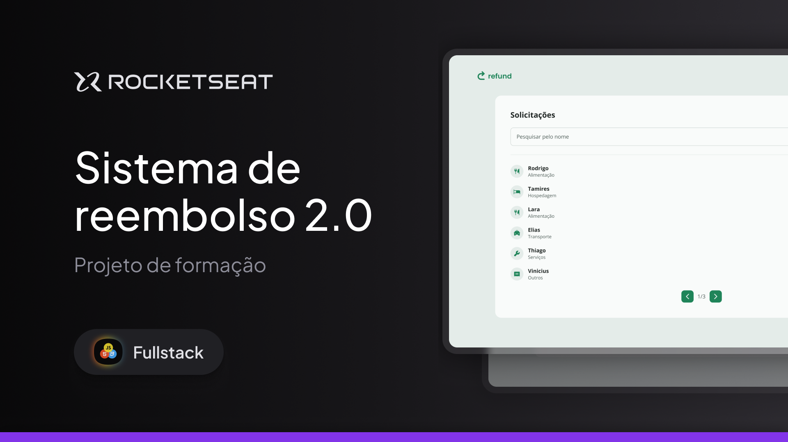

# Refund 2.0 — App de Solicitação de Reembolsos

<p align="center">
  
</p>

Aplicação **frontend** desenvolvida com **React + TypeScript + Vite** e estilizada com **Tailwind CSS**.  
O objetivo é permitir que colaboradores enviem pedidos de reembolso com comprovantes e que **managers** visualizem e gerenciem essas solicitações (busca e paginação).

## 🎨 Design (Figma)

Protótipo e especificações no Figma (Dev Mode habilitado):  
https://www.figma.com/design/8mY8iCcuuLfSCApuQBAww4/Sistema-de-reembolso-2.0--Community-?node-id=0-1&p=f&m=dev

## ✨ Funcionalidades

- Autenticação (páginas de **Sign In** e **Sign Up**).
- Dois papéis de usuário:
  - **Employee**: envia solicitações de reembolso.
  - **Manager**: lista, pesquisa e pagina as solicitações.
- Formulário de reembolso:
  - Nome, valor, categoria e **upload** de comprovante.
  - Tela de **confirmação** antes do envio.
- **Dashboard do manager**:
  - Campo de pesquisa por nome.
  - **Paginação**.
  - Cartão de item com nome, categoria, valor e ícone da categoria.
- Componentes reutilizáveis: `Input`, `Select`, `Button` (com variantes), `Upload`, `RefundItem`, `Pagination`, `Header`.
- Utilitários: `formatCurrency`, `classMerge`, `CATEGORIES` (mapeia categorias → ícone/label).
- Acessibilidade e UX: estados de loading/disabled, foco visível e scroll customizado.


## 🧱 Stack

- **React** + **TypeScript** + **Vite**
- **Tailwind CSS**
- **React Router**
- **ESLint**

## 🗂 Estrutura (resumo)


## 🚀 Como rodar

Pré-requisitos: **Node 18+** e **npm** (ou **pnpm/yarn**).

```bash
# instalar dependências
npm install

# ambiente de desenvolvimento
npm run dev


